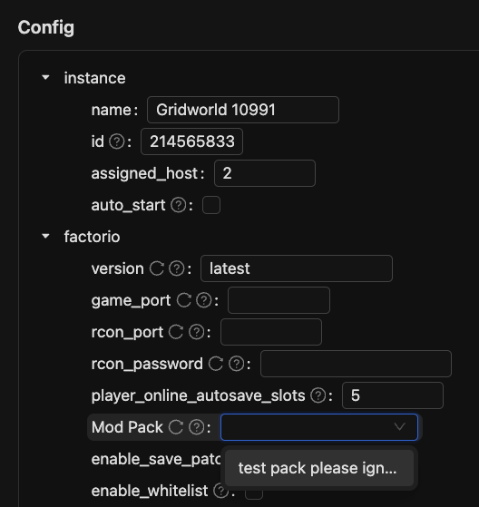
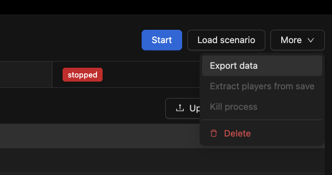
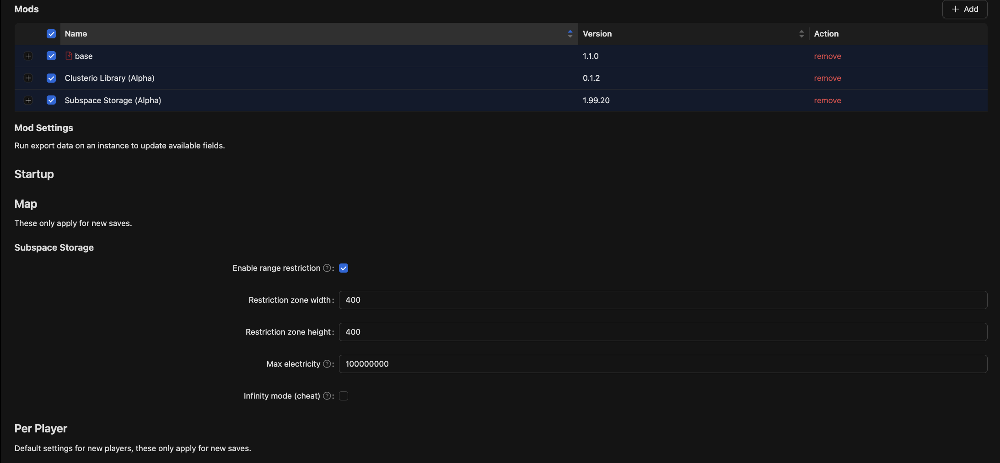

<br/>
<br/>
<br/>

# Clusterio

Discord for development/support/play: https://discord.gg/5XuDkje

## Important notice

Clusterio 2.0 is still in alpha, however the previous stable has been abandoned and is no longer supported.
Despite being alpha it's reasonably stable now and there's no major breakages expected before a stable release of 2.0.
If you are starting a new cluster, it's highly recommended to use the 2.0 alpha.


### Ways to support me/the project:

* Contribute with code/documentation.
  See [Contributing](docs/contributing.md) for how to make pull requests.
  Always nice to move the project forward.

* Support me monetarily on [patreon](https://www.patreon.com/danielv123) or paypal: danielv@live.no

### Table of contents

* [Introduction](#introduction)
* [Features](#features)
* [Plugins](#plugins)
* [Installation](#installation)
  * [Ubuntu setup](#ubuntu-setup)
  * [Windows setup](#windows-setup)
  * [MacOS setup](#macos-setup)
  * [Installing Plugins](#installing-plugins)
* [Configure Controller](#configure-controller)
* [Managing Factorio mods](#managing-factorio-mods)
* [Setting up shared storage](#setting-up-shared-storage)
* [Running Clusterio](#running-clusterio)
* [Setting up remote hosts](#setting-up-remote-hosts)
* [Setting up clusterioctl](#setting-up-clusterioctl)
* [Known issues](#known-issues)
* [Common problems](#Common-problems)


## Introduction

Clusterio is a clustered Factorio server manager that provides the tooling for implementing cross server interactions in Factorio.
It was previously best known for implementing cross server transfer and cloud storage of items via teleporter chests.
But this functionality has been pulled out of Clusterio into its own plugin for Clusterio named [Subspace Storage](https://github.com/clusterio/subspace_storage).

By itself Clusterio doesn't change the gameplay in any way, you could even use Clusterio to manage completely vanilla Factorio servers.
Plugins do the work of modding in the visible changes into the game, see the [Plugins section](#plugins) for ready-made plugins you can install into a Clusterio cluster.


## Features

- Clustered Factorio server management allowing you manage the running of Factorio servers across a fleet of physical servers from both a web interface and a command line interface.

- User list management for synchronizing in-game admins, whitelisted users, and bans to all the servers in the cluster.

- Integrated support for exporting statistics for the whole cluster to Prometheus via a single metrics endpoint.

- Extensive plugin support for adding your own cross server features to Factorio using Clusterio's communication backbone.


## Plugins

The heart of Clusterio is its plugin system.
Plugins add functionality to Factorio servers, Clusterio itself or both.
These are the plugins supported and maintained by the Clusterio developers:

- [Global Chat](/plugins/global_chat/README.md): share the in-game chat between servers.
- [Research Sync](/plugins/research_sync/README.md): synchronize research progress and technologies unlocked between servers.
- [Statistics Exporter](/plugins/statistics_exporter/README.md): collect in-game statistics from all the servers and makes it available to the Prometheus endpoint on the controller.
- [Subspace Storage](https://github.com/clusterio/subspace_storage): Provide shared storage that can transport items between servers via teleport chests.
- [Player Auth](/plugins/player_auth/README.md): Provides authentication to the cluster via logging into a Factorio server.
- [Inventory Sync](/plugins/inventory_sync/README.md): Synchronizes your inventory between servers.

There's also plugins developed and maintained by the community:

- [Discord Bridge](https://github.com/Hornwitser/discord_bridge) (@hornwitser/discord_bridge): Bridges chat between instances and Discord.
  By Hornwitser.
- [Server Select](https://github.com/Hornwitser/server_select/tree/clusterio-2.0) (@hornwitser/server_select): In-game GUI for connecting to other servers in the cluster.
  Originally by Godmave, ported to 2.0 by Hornwitser.

Want to make your own plugin?
Check out the documentation on [Writing Plugins](/docs/writing-plugins.md) for where to start.


## Installation

Clusterio runs on all LTS version of NodeJS, it is distributed via npm and comes with a guided install script.
If you already have a recent Node.js installed, you can set it up in a new directory with:

    npm init "@clusterio"

Otherwise see below for OS specific instructions.  
Check out all our of decisions for [node, factorio, and operation support](/docs/decisions.md#supportability).

### Ubuntu setup

1.  Install Node.js v18 or higher.
    Note the version of Node.js provided by the Ubuntu/debian repos are too old and you will have to use the nodesource PPA

        curl -fsSL https://deb.nodesource.com/setup_20.x | sudo -E bash - &&\
        sudo apt-get install -y nodejs

2.  Log in as the user you wish to install Clusterio as (do not use root), and then create a new directory and run the Clusterio installer:

        mkdir clusterio
        cd clusterio
        npm init "@clusterio"

    Make sure to note down the admin authentication token it provides at the end as you will need it later.

3.  Optionally copy the generated systemd service files in `systemd` folder to `/etc/systemd/system/`.


**Ubuntu with Docker**

The Docker support for Clusterio is currently broken.
If you need it open an issue about it.

<!--
Clusterio has *very* limited support for using docker.

    sudo docker build -t clusterio --no-cache --force-rm clusterio

	sudo docker run --name controller -e MODE=controller -p 1234:8080 -d -it --restart=unless-stopped danielvestol/clusterio

	sudo docker run --name host -e MODE=host -e INSTANCE=world1 -v /srv/clusterio/instances:/clusterio/instances -p 1235:34167 -it --restart=unless-stopped danielvestol/clusterio

The -v flag is used to specify the instance directory.
Your instances (save files etc) will be stored there.
-->

### Windows setup

1.  Download and install the latest LTS release from http://nodejs.org.

2.  Create a new empty directory for the installation and navigate into it.
    Open a PowerShell window in this new directory by Shift+Right clicking inside it and choosing "Open PowerShell window here" and then run the following command.

        npm init "@clusterio"

    Make sure to note down the admin authentication token it provides at the end as you will need it later.

3.  If you chose to use local factorio directory for the Factorio installation, download the Windows 64-bit zip package from https://www.factorio.com/download and extract it to the `factorio` folder in your clusterio installation folder.


### MacOS Setup

1.  Install the latest Node.js LTS release from http://nodejs.org or use brew (`brew install node`).

2.  Open Terminal or Command prompt in the directory you want to install to and run the following commands.

        mkdir clusterio
        cd clusterio
        npm init "@clusterio"

    Make sure to note down the admin authentication token it provides at the end as you will need it later.

3.  If you chose to use local factorio directory for the Factorio installation, you will need to obtain and copy a mac version of Factorio and unpack it to the `factorio` folder in your clusterio installation folder.


### Installing Plugins

For well-known plugins you can select them during installation and no further steps are necessary to make them work.
Installing plugins that are not offered by the installer consists of two steps.
First install the package the plugin is provided by via npm, for example

    npm install @clusterio/plugin-subspace_storage

Then tell clusterio that this plugin exists by adding it as a plugin.

    npx clusteriocontroller plugin add @clusterio/plugin-subspace_storage

This adds it to the default `plugin-list.json` file which in the shared folder setup is loaded by controller, host and ctl.
If you have hosts or ctl installed on separate computers (or directories) then you need to repeat the plugin install process for all of them.
The clusteriocontroller, clusteriohost and clusterioctl commands has the plugin sub-command so you do not need to install clusteriocontroller to add plugins, instead use the clusterio command you have available.

For development purposes the `plugin add` command supports adding plugins by the absolute path to them, or a relative path that must start with either . or .. (which will then be resolved to an absolute path).


## Configure Controller

By default the controller will listen for HTTP on port 8080.
You can change the port used with the command

    npx clusteriocontroller config set controller.http_port 1234

When changing the port you will also need to change the address hosts connect with.
For the standalone installation mode you can use

    npx clusteriohost config set host.controller_url http://localhost:1234/

If you plan to make your cluster available externally set the address
that it will be accessible under with, for example

    npx clusteriocontroller config set controller.public_url http://203.0.113.4:1234/

Change the url to reflect the IP, protocol, and port the controller is accessible under, dns names are also supported.
If you're planning on making the controller accessible on the internet it's recommended to set up TLS, see the [Setting Up TLS](/docs/setting-up-tls.md) document for more details.

You can list the config of the controller with the `npx clusteriocontroller config list` command.
See the [readme for @clusterio/controller](/packages/controller/README.md) for more information.


## Managing Factorio mods

Mods in clusterio are managed as parts of modpacks. There is currently no mod portal integration, so you first need to navigate to the mods section of the web UI and upload your mods. You can then create a modpack from the uploaded mods by navigating to the mods page, hitting `create`. Once you have a modpack, you can assign it to an instance under Instance config -> Factorio -> Mod pack. You can also set a default modpack for new instances in the controller settings.



Mod settings can be managed under the modpack configuration page in the web UI. For mod settings to show, you first need to run an export. This is done by creating an instance with the modpack assigned, opening the instance page and pressing More -> Export data.



Once this is done, the mod settings will show up under the modpack configuration page.




## Setting up shared storage

The chests teleporting items to and from the shared storage on the controller has been moved into the Subspace Storage mod and plugin.
To get this to work you will need to install the Subspace Storage plugin and copy the [Subspace Storage mod](https://mods.factorio.com/mod/subspace_storage) and the [Clusterio Lib mod](https://mods.factorio.com/mod/clusterio_lib) into the `sharedMods` folder on each host installation.

Do not install the [Clusterio mod](https://mods.factorio.com/mod/clusterio), this was for the old 1.2.x version of Clusterio and is not compatible with Clusterio 2.0.


## Running Clusterio

After completing the installation and creating your admin user, start up the controller and at least one host separately.
The installer provides the `run-controller` and `run-host` scripts to make this simple.
Once the controller process is running you can log into the web interface which is hosted by default on http://localhost:8080/ (adjust the port number if you changed it), use the admin authentication token provided from the installation to log in.

The basics of setting up a Factorio server from the web interface is to create an instance, assign it to a host and then click start. You can also use the "Connect via Steam" button to launch Factorio directly and connect to the server using Steam's protocol handler.

### Running via Systemd

The install script creates systemd service scripts for clusteriocontroller and clusteriohost (if applicable) to start up as the user than ran the installer.
If you have copied these files over to `/etc/systemd/system/` then you can startup Clusterio as a background service using:
    
#### To start as a service run:
 
    sudo systemctl start clusteriocontroller # for the controller
    sudo systemctl start clusteriohost # for each physical server intended to host Factorio servers

#### To automatically get it to start on boot:
 
    sudo systemctl enable clusteriocontroller # for the controller
    sudo systemctl enable clusteriohost # for each physical server intended to host Factorio servers


## Setting up remote hosts

Run the installer as described in the installation section and choose "Host only" as the operating mode to install, it'll ask for a controller URL and an authentication token.
The URL is the same as what is needed to connect to the web interface, and the authentication token can be generated on the Hosts page in the web interface.
Once you start up the host it should show up in the Hosts list and be available for assigning and running instances on.


## Setting up clusterioctl

There's a command line interface available for Clusterio which is installed separately with the same installer as for the controller and host.
Run the installer as described in the installation section and choose "Ctl only" as the operating mode to install, you can do this in the same directory as you have installed other Clusterio component(s) to.
The installer will ask for a controller URL and an authentication token, these are the same as you would use to connect to the web interface.
If you want to use a different user for the command line interface, you can generate an authentication token for an existing user with

    npx clusteriocontroller bootstrap generate-user-token <username>


## Known Issues

- When the `server_select` plugin is installed you may see `[error] Unhandled event server_select:UpdateInstancesEvent` logged when starting an instance.
  This should be ignored as it does not indicate an error occured.
- After updating Factorio you may get the error `Error: Expected empty response but got "Cannot execute command. Error: [string "clusterio_private.update_instance(..."]:1: attempt to index global 'clusterio_private' (a nil value)?` on instance start.
  This is due to Factorio applying a migration replacing the patched content of the save with the original scenario, attempting to start the instance again should resolve the issue.
- In the mod pack view of the web interface the "base" mod is displayed with an error complaining about the mod being missing from the controller storage.
  This is due to the "base" mod currently not being connectly handled as a built-in mod to Factorio in the web interface, this error message should be ignored.
- After migrating from Alpha 13 to Alpha 14 running an instance data export fails with the error `Upload failed: 401 Unauthorized` due to the host token being issued to a slave.
  To workaround this find the id of the host in the host config and generate a new host token with the same id.
  Stop the host and replace the value of the `host.controller_token` field in `config-host.json` with the new host token before starting it up again.
- After migrating from Alpha 13 to Alpha 14 you get kicked out from the web interface due to the master to controller rename.
  If you don't have the authentication token readily available you can manually migrate the token by opening the Inspect/Developer Tools on the page and running the following piece of JavaScript in the Console:
  ```
  localStorage.controller_token = localStorage.master_token
  ```


## Common problems

### EACCESS [...] LISTEN 443

Some systems don't let non root processes listen to ports below 1000.
Either run with `sudo` or change config.json to use higher port numbers.

According to [this link](https://askubuntu.com/questions/839520/open-port-443-for-a-node-web-app) if you manually installed node.js following the above instructions, you may need to run the following command to fix this issue:

    sudo setcap 'cap_net_bind_service=+ep' $(readlink -f $(which node))

### Port forwarding doesn't work on the controller when running under WSL

If you follow the ubuntu guide on WSL (Windows Subsystem for Linux, Bash on Ubuntu on Windows specifically), you will find that the website works on localhost and on your local ip, but not on the global ip.
This is also true when you correctly port-forwarded the correct ports.
Even when routing this server through nginx in WSL, the issue persists.
Then, on a hunch, I tried to run nginx from windows itself and found that this DID work.
It came to me that the only usage difference between the 2 versions of nginx is that I got a Windows Firewall popup.

TLDR: the tested fix is:

- open your windows firewall and go to advanced settings

- click on inbound rules and click on new rule...

- select port and click next >

- select TCP and select specific local ports and type in the ports that you want to open (comma separated) and click next > 3 times

- give the rule a name (like 'web server' or something), give it a description (optionally) and click finish
