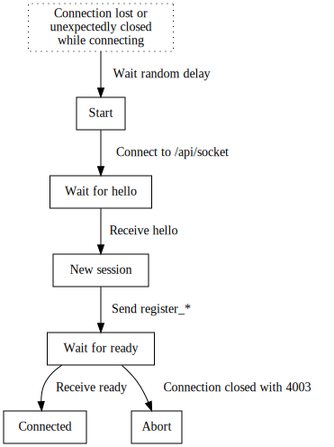
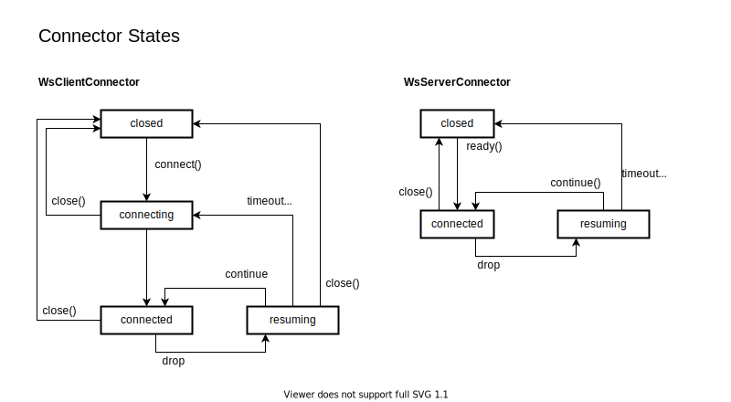
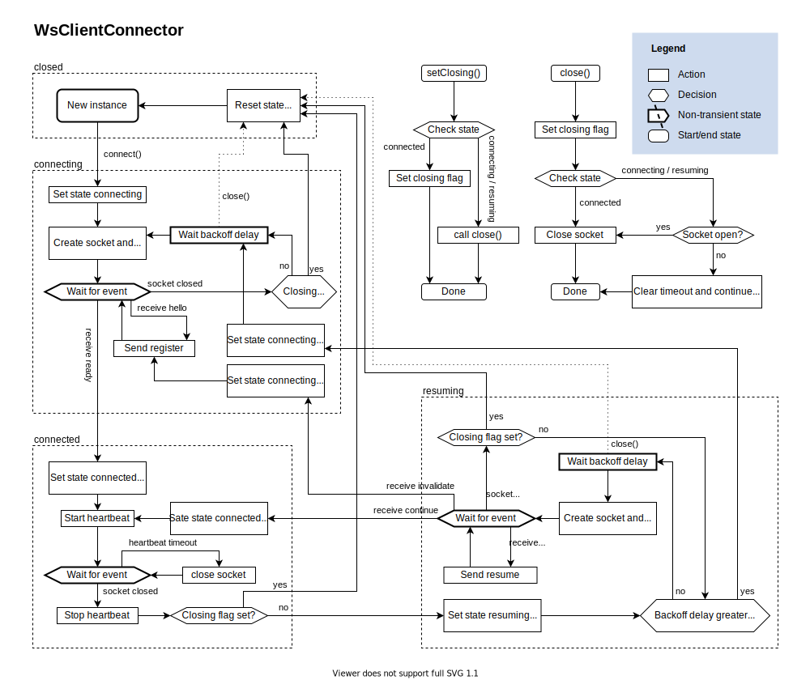
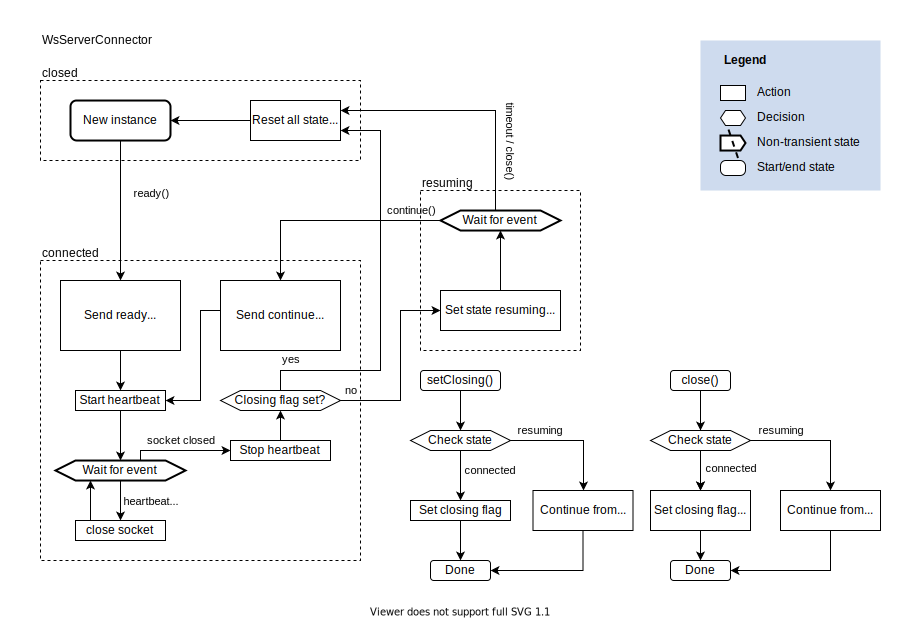

# Protocol

Clusterio communicates using a simple homebrew message passing protocol based on JSON over WebSocket with limited support for reliable transport of messages.
The protocol is implemented in [packages/lib/link](/packages/lib/link) and uses the `ws` library to handle the WebSocket connections on the Node.js side and the native WebSocket API on the browser side.

Two general kinds of messages are supported: events and requests.
Events are messages sent by one party and received by the other and offer no notification for the sender on whether it was actually received.
Requests are pairs of request-response messages where one side sends the requests and the other side replies with a response.
Apart from the handshake used to establish connections the protocol is directionless, and either party can send or receive both requests and events.

Events and requests are defined as instances of the `Request` and `Event` classes, and specify a unique type string, who can send and receive the message, optional forwarding of the message and the format of the data payload as a JSON schema.
All messages sent and received are validated with JSON schemas to catch potential errors in sending messages and avoid having to write lots of validation code in message handlers.

Messages are sent by calling the `.send()` method of the message instance and passing a `Link` instance to send it over and the data to send.
For the controller there's a `Link` instance for each slave and control connection stored in the `WsServer` class.
For slaves the `Slave` instance is a link to the controller, and each `Instance` instance is an in-memory link to the `Slave` instance and has a corresponding `InstanceConnection` link stored on the `Slave` instance.
For ctl and web_ui there's a `Control` instance that acts as the link to the controller.

Messages received invokes message handlers that were registered when the link was brought up.
These handlers are named after the name of the property the message is stored under with `EventHandler` appended for events and `RequestHandler` appended for requests.
The handlers are defined on the link class itself for core messages, and on the plugin class in the case of plugin defined messages.


## Connection flow

Clients connect via WebSocket to the `/api/socket` endpoint and upon establishing connection to the server the connection is in the handshake phase and the server will send a `hello` message to the client.
If the client has no previous session with the server it sends a `register_slave` or `register_control` message depending on what kind of client it is to the server.
If the register is valid then the server will respond with a `ready` message with a session token and the connection has left the handshake phase, otherwise the server will close the connection with a WebSocket close code indicating the kind of failure.

Upon leaving the handshake phase both parties should start sending heartbeat messages with the sequence number of the last received message.
Messages sent over the link should be stored in a send buffer and only cleared from the send buffer when a heartbeat with a `last_seq` equal or or higher is received or the session is invalidated.

If the connection goes stale or is unexpectedly closed the client can reastablish the same session by connecting to the server again and sending a `resume` message after received the `hello` from the server.
If the session resume is successful then the server will respond with a `continue` message and the connection is active again.
The client should then re-send all messages it has in its send buffer that is greater than the `last_seq` number in the `continue` message.
Otherwise the server will respond with `invalidate` and the client is expected to drop its send buffer start a new session with `register_slave` or `register_control`.




## Connector flow

To manage the complexity of connecting, reconnecting, resuming or invalidating dropped sessions the WebSocket connection for a `Link` class is managed by a connector.
There's three kinds of connectors defined: `WebSocketClientConnector`, `WebSocketServerConnector` and `VirtualConnector`.
The virtual connector is for in-memory connections and doesn't have any connection state logic.

For the WebSocket connectors there's four states they can exist in:
- `closed` - The connector has just been created or has been explicitly closed.
- `connecting` (client only) - The connector is in the process of trying to connect to the server.
- `connected` - The connector is successfully connected.
- `resuming` - The connection dropped and the connector is in the process of attempting to resume it.

Along with the following events emitted when transition between states:
- `connect` From `connecting` (client) or `closed` (server) to `connected`
- `drop` - From `connected` to `resuming`
- `resume` - From `resuming` to `connected`
- `invalidate` - From `resuming` to `connecting` or `closed`
- `close` - From any state to `closed`




### WsClientConnector

The client connector will keep trying to establish and mantain a connection after `.connect()` is called on it, stopping only in the case of authentication failure or `.close()`/`.setClosing()` being called.
Other than that, the logic is pretty straight forward.




### WsServerConnector

The server connector doesn't do the work of connecting or validating the handshake.
Instead it's handed over a WebSocket connection from `WsServer` once there's only the step of sending the final message left to do.
Because of this there's no `connecting` state, and once a session times out from the `resuming` state it goes directly to closed.




## Wire format

All communication in the protocol is done via WebSocket text frames containing a JSON payload with the following properties:

- `seq: integer | null` - The sequence number of the message, can only be null for handshake and heartbeats.
- `type: string` - The type of message
- `data: object` - Message data

Before a connection is established it's in the handshake phase and the `seq` property is `null`.
The `type` property is used to distinguish which of handshake, heartbeat, events or requests this message is and determines the expected format of the `data` property.


### Handshake Messages

The following messages are the only valid messages that can be sent during the handshake phase.


#### `hello`

Sent by the controller when the WebSocket connection has been opened.

- `version: string` - The version of the controller, e.g. "2.0.0".
- `plugins: Object<string, string>` -
    Object mapping plugin names to plugin version for plugins that are loaded on the controller.

#### `register_slave`

Slave handshake for establishing a new connection session.

- `token: string` - Authentication token.
- `agent: string` - Human readable string of the software connecting.
- `version: string` - The protocol version of the slave, e.g. "2.0.0".
- `name: string` - Name of the slave.
- `id: integer` - ID of the slave.
- `plugins: Object<string, string>` -
    Object mapping plugin names to plugin version for plugins that are available on the slave.

#### `register_control`

Control handshake for enstablishing a new connection session.

- `token: string` - Authentication token.
- `agent: string` - Human readable string of the software connecting.
- `version: string` - The protocol version of the control, e.g. "2.0.0".

#### `resume`

Handshake for resuming an existing connection session where the connection had dropped unexpectedly.

- `session_token: string` - Session token to resume session with.
- `last_seq: integer | null` - Last message seq received by the client.

#### `invalidate`

Sent by the controller in reply to a resume for a session that cannot be resumed.
The client should start a new session with a register\_\* message in response.

#### `continue`

Sent by the controller to signal resuming the session was successful.

- `last_seq: integer | null` - Last message seq received by the server.
- `session_timeout: integer` - Session timeout in seconds.
- `heartbeat_interval: number` - Rate client should send heartbeats at.

#### `ready`

Sent by the controller to signal the connection has been established with a new session.

- `session_token: string` - Token to resume the session with.
- `session_timeout: integer` - Session timeout in seconds.
- `heartbeat_interval: number` - Rate client should send heartbeats at.


### Heartbeat message

Once connected as indicated by the `ready` and `continue` messages both sides of the connection starts sending heartbeats at the inverval given in the `ready` and `continue` messages.
The heartbeat should contain the `seq` of the last received message, and receiving a heartbeat with a given sequence number means that the other party of the link has received all messages up to that seq number.


#### `heartbeat`

Sent by both the controller and clients at the interval given in the continue/ready messages.

- `last_seq: integer` - Last message seq received over the link.

### Events

Events are messages send in one direction over the link, that the receiver is expected to act upon, but not make any replies (for that there's [Requests](#requests).
By convention message types ending in `*_event` are events.
The data payload of an event consists solely of event specific properties.

See [packages/lib/link/messages.js](/packages/lib/link/messages.js) for the recognized core events and their contents.
Plugins may defined their own events as well.

#### `*_event`

- any properties defined by the event type.


### Requests

Requests are messages which expects a response in return.
They function a lot like HTTP requests except that both parties of a connection can inniate a request that is expected to be responded to.
By convention message types ending in `*_request` are requests, and is expected to be replied to with a corresponding `*_response` message.
If an error occured while processing the request an error response containing an error property in the data payload is sent instead.

See [packages/lib/link/messages.js](/packages/lib/link/messages.js) for the recognized core requests and their contents.
Plugins may define their own requests as well.

#### `*_request`

- any properties defined by the request type.

#### `*_response` success

- `seq: integer` - The seq number of the request message.
- any additional properties defined by the request type.

#### `*_response` error

- `seq: integer` - The seq number of the request message.
- `error: string` - Human readable text message describing the error.


### Graceful Disconnect

To ensure no data is lost when closing the link it's important to send a prepare disconnect request and wait for it to complete before closing the WebSocket.
Either party of the link can send this request and the party sending the request should be the one that initates the close of the WebSocket.

#### `prepare_disconnect_request`

Request graceful disconnect of the connection.
The receiving party should stop tasks that send events and requests over the link and wait for pending requests it has over the link to complete, but it should not stop responding to requests sent to it.
Only after this process is done should the response be sent.

#### `prepare_disconnect_response`

Signals the preparation for disconnect is complete and that the connection can be closed.
The party that initiatied the prepare disconnect request may still send other requests/events over the link to finish its part of the disconnection proceedure.

If the error response variant is received it should be logged if possible and treated as a success.


### Example handshake

Server hello after opening the WebSocket.

```json
{
    "seq": null,
    "type": "hello",
    "data": {
        "version": "2.0.0"
    }
}
```

Slave registering a new connection session.

```json
{
    "seq": null,
    "type": "register_slave",
    "data": {
        "token": "xyzabc123",
        "agent": "Clusterio Slave",
        "version": "2.0.0",
        "name": "Foo",
        "id": 123
    }
}
```

Controller reply signaling the session is established and ready.

```json
{
    "seq": null,
    "type": "ready",
    "data": {
        "session_token": "xyz.azy.bzy",
        "session_timeout": 60,
        "heartbeat_interval": 15
    }
}
```

Slave and controller can now send events and requests over the connection.
