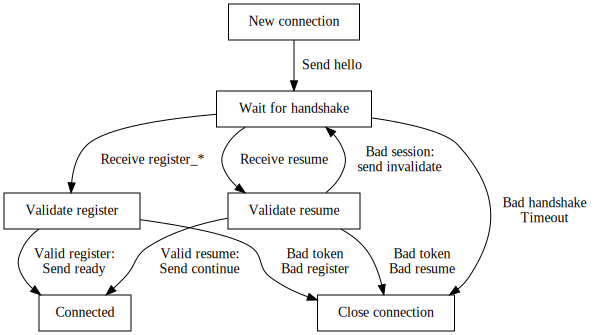

WebSocket protocol
==================

<sub>This document describes the protocol used between the master and
slaves, and unless you're developing Clusterio it's probably not going
to be very useful for you.</sub>

The protocol is built on WebSocket and uses JSON encoded text messages
to communicate to and from the master server.  These messages contain
a JSON encoded object with the following three properties:

- seq - integer|null - The sequence number of the message
- type - string - The type of message
- data - object - Message data

For the handshake and heartbeats the seq property is null.


Handshake
---------

Upon connecting to the WebSocket endpoint the server will respond with a
`hello` message containing the master server version as the data.  The
client is then expected to send either `register_*` or a `resume`
message to set up the connection with the master.  The exact flow is
described below.


### Client connection flow

For a client making a new connecting to the master server the first
course of action after obtaining a token is to connect with WebSocket to
the /api/socket endpoint and wait for the server hello.  After the
hello, the client sends a register\_\* message corresponding to the type
of the client.  If successful the server will reply with a ready message
and the connection has been established.  See the flowchart below.


If for any reason the connection is closed or lost during the connection
attempt the process is started over after a random delay, with the
exception of the connection being closed with a 4003 code which means
authentication failed and the client should stop trying to connect.  The
wait for hello and wait for ready states should also have a timeout,
after which the connection is closed if the hello/reply wasn't received
in time.


### Client reconnection flow

If the connection is lost after the client has received the ready
message from the server it should attempt a reconnect instead.  This is
very similar to a new connection, but instead of a register\_\* messsage
the client sends a resume message and the server replies with a continue
message if resuming the session was successful.  This continue message
has sequence number of the last message the master received and the
client is expected to imediately send all messages from its send buffer
that occured after the sequence number given.

The server will respond with an invalidate message if resuming the
session is not possible.  In this case the client should continue from
the new session state of the connection flow (see the previous section).


Like the connection flow the process starts over after a delay if the
connection is closed or lost.  The same exception for connection closed
with 4003 applies as with the connection flow.  Additionally after an
invalidate message has been received and the connection flow fails, it
should start over from the connection flow.


### Server connection flow

From the master server side new connections and reconnection attempts
start out the same, a new connection has been made and the server sends
the hello messoge to the client.  If a vaild register\_\* message is
received a new connection is set up for the client and the ready message
is sent in reply.  If a valid resume message is received and the session
that's attempted to be resumed is active it'll signal that the session
is resumed with a continue message and the client upon receiving the
continue message should send the messages from its send buffer from
after the last\_seq given in the continue message.

If the session token used to resume is not valid it'll send an invalidate
message and expect the client to continue with a registr\_\* message.  If an
invalid or unexpected message is received during the handshake the connection
is closed.  See the flowchart below.



For authentication failure the connection is closed with code 4003,
which the connection client should interpret as connecting will never
succeed and stop trying to reconnect.


### Connection tracking and heartbeats

Once connected as indicated by the ready and continue messages from the
master server the client must start sending heartbeats at the interval
given in the ready/continue message, and storing messages sent over the
link in a sending side buffer.  The heartbeats sent must have the seq of
the last received message on the link and acts as an ack for received
messages.  The master server also sends heartbeats in the same manner
and the client should remove messages up to and including the sequence
number received in the heartbeat from its send buffer.


Handshake messages
------------------

### `hello`

Sent by the master server when the WebSocket connection has been opened.

- version - string - The version of the master, e.g. "2.0.0".
- plugins - Object&lt;string, string&gt; -
    Object mapping plugin names to plugin version for plugins that are
    loaded on the master server.

### `register_slave`

Slave handshake for establishing a new connection session.

- token - string - Authentication token.
- agent - string - Human readable string of the software connecting.
- version - string - The protocol version of the slave, e.g. "2.0.0".
- name - string - Name of the slave.
- id - integer - ID of the slave.
- plugins - Object&lt;string, string&gt; -
    Object mapping plugin names to plugin version for plugins that are
    available on the slave.

### `register_control`

Control handshake for enstablishing a new connection session.

- token - string - Authentication token.
- agent - string - Human readable string of the software connecting.
- version - string - The protocol version of the control, e.g. "2.0.0".

### `resume`

Handshake for resuming an existing connection session where the
connection had dropped unexpectedly.

- session_token - string - Session token to resume session with.
- last_seq - integer|null - Last message seq received by the client.

### `invalidate`

Sent by the master server in reply to a resume for a session that cannot
be resumed.  The client should start a new session with a register\_\*
message in response.

### `continue`

Sent by the master server to signal resuming the session was successful.

- last_seq - integer|null - Last message seq received by the server.
- heartbeat_interval - number - Rate client should send heartbeats at.

### `ready`

Sent by the master server to signal the connection has been established
with a new session.

- session_token - string - Token to resume the session with.
- heartbeat_interval - number - Rate client should send heartbeats at.

### `heartbeat`

Sent by both the master server and clients at the interval given in the
continue/ready messages.

- last_seq - integer - Last message seq received over the link.


Example handshake
-----------------

Server hello after opening the WebSocket.

```json
{
    "seq": null,
    "type": "hello",
    "data": {
        "version": "2.0.0"
    }
}
```

Slave registering a new connection session.

```json
{
    "seq": null,
    "type": "register_slave",
    "data": {
        "token": "xyzabc123",
        "agent": "Clusterio Slave",
        "version": "2.0.0",
        "name": "Foo",
        "id": 123
    }
}
```

Master server reply signaling the session is established and ready.

```json
{
    "seq": null,
    "type": "ready",
    "data": {
        "session_token": "xyz.azy.bzy",
        "heartbeat_interval": 45
    }
}
```


Events
------

Events are messages send in one direction over the link, that the
receiver is expected to act upon, but not make any replies (for that
there's [Requests](#requests).  By convention message types ending in
`*_event` are events.  The data payload of an event consists solely of
event specific properties.

See [lib/link/messages.js](/packages/lib/link/messages.js) for the
recognized events and their contents.


Requests
--------

Requests are messages which expects a response in return.  They function
a lot like HTTP requests except that both parties of a connection can
inniate a request that is expected to be responded to.  By convention
message types ending in `*_request` are requests, and is expected to be
replied to with a corresponding `*_response` message.  If an error
occured while processing the request an error response containing an
error property in the data payload is sent instead.

See [lib/link/messages.js](/packages/lib/link/messages.js) for the
recognized requests and their contents.

### `*_response`

- seq - integer - The seq number of the request message.
- additional properties may be present depending on the type of request.

### `*_response` error

- seq - integer - The seq number of the request message.
- error - string - Human readable text message describing the error.


Graceful Disconnect
-------------------

To ensure no data is lost when closing the link it's important to
send a prepare disconnect request and wait for it to complete before
closing the WebSocket.  Either party of the link can send this request
and the party sending the request should be the one that initates the
close of the WebSocket.

### `prepare_disconnect_request`

Request graceful disconnect of the connection.  The receiving party should
stop tasks that send events and requests over the link and wait for
pending requests it has over the link to complete, but it should not
stop responding to requests sent to it.  Only after this process is done
should the response be sent.

### `prepare_disconnect_response`

Signals the preparation for disconnect is complete and that the
connection can be closed.  The party that initiatied the prepare
disconnect request may still send other requests/events over the link to
finish its part of the disconnection proceedure.

If the error response variant is received it should be logged if
possible and treated as a success.
