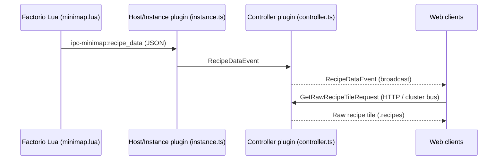

# Crafting-Recipe Overlay for Minimap & Timelapse

## Overview
Records which recipe every crafting machine is running, streams live changes to web clients, and replays them frame-perfectly in timelapse mode. The solution:

* Works for all forces & surfaces
* Scales to millions of events using compact binary storage
* Allows cheap frustum-culling using 256×256 map tiles
* Uses append-only storage so historical data is never rewritten

## Architecture

### Event Flow

### Messages
| Message                            | Direction                   | Purpose                     |
| ---------------------------------- | --------------------------- | --------------------------- |
| `RecipeDataEvent`                  | instance → controller → web | Single recipe change (live) |
| `GetRawRecipeTileRequest/Response` | web → controller            | Fetches binary recipe tile  |

## Storage Format

### Tile Organization
Uses same 256×256 world-unit tiles as terrain data. 
Filename: `<instance>_<surface>_<force>_<tileX>_<tileY>.recipes`
Stored in: `database_directory/minimap_recipe_tiles/`

### Binary Record Format (append-only)
All numbers **big-endian**.

| Bytes               | Field            | Description                                   |
| ------------------- | ---------------- | --------------------------------------------- |
| 1                   | `type`           | `0=DictEntry`, `1=SetRecipe`, `2=ClearRecipe` |
| **DictEntry (0)**   |                  |
| 2                   | `index` (uint16) | Dictionary ID (0-65535)                       |
| 1                   | `len` (uint8)    | UTF-8 byte length                             |
| n                   | name bytes       | Recipe name string                            |
| **SetRecipe (1)**   |                  |
| 4                   | `sec` (uint32)   | ⌊tick / 60⌋ timestamp                         |
| 1                   | `px` (uint8)     | X position in tile (0-255)                    |
| 1                   | `py` (uint8)     | Y position in tile (0-255)                    |
| 2                   | `index` (uint16) | Dictionary ID                                 |
| **ClearRecipe (2)** |                  |
| 4                   | `sec` (uint32)   | ⌊tick / 60⌋ timestamp                         |
| 1                   | `px` (uint8)     | X position in tile (0-255)                    |
| 1                   | `py` (uint8)     | Y position in tile (0-255)                    |

Dictionary entries are written only when a previously unseen recipe name is required for that tile.

### Space Efficiency
- ~8x more compact than JSON format
- Dictionary compression eliminates recipe name repetition
- Per-tile dictionaries keep indices small (uint16 sufficient)

## Playback

### Live Mode
- `RecipeDataEvent` broadcasts like `TileDataEvent`
- Web UI maintains `Map<posKey, recipeName>` for instant icon updates
- Icons render using Factorio sprite metadata

### Timelapse Mode
- Downloads `.recipes` files via `GetRawRecipeTileRequest`
- Parses binary format using shared `parseRecipeTileBinary()` utility
- Applies Set/Clear records up to selected timeline tick
- Integrates with existing terrain timelapse system

## Scalability
| Metric                         | Estimate                      |
| ------------------------------ | ----------------------------- |
| Assemblers per large factory   | ~50,000                       |
| Avg recipe changes per machine | ~5 lifetime                   |
| Bytes per Set/Clear record     | 8 bytes                       |
| Total storage per instance     | ~2 MB                         |
| Max recipes per tile           | <1,000 (well under 65K limit) |
