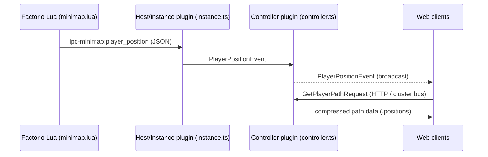

# Player Position Tracking

## Overview
Tracks player positions across the map, streams live movements to web clients, and stores compressed historical data for timeline playback.

## Architecture

### Event Flow


### Messages
| Message                         | Direction                   | Purpose                 |
| ------------------------------- | --------------------------- | ----------------------- |
| `PlayerPositionEvent`           | instance → controller → web | Live position update    |
| `GetPlayerPathRequest/Response` | web → controller            | Fetches historical path |

## Storage Format

### Coordinate Encoding
- **Map size**: 2m × 2m (2 000 000 × 2 000 000 tiles)
- **Resolution**: 1 tile
- **Encoding**: 24-bit signed integers per coordinate (±8,388,608 tiles)
- **Storage**: 3 bytes per coordinate (x_tiles, y_tiles) (24 bits)

### Binary Record Format (append-only)

| Bytes                | Field                | Description                                    |
| -------------------- | -------------------- | ---------------------------------------------- |
| 1                    | `type`               | `0=Position`, `1=SessionStart`, `2=SessionEnd` |
| **Position (0)**     |                      |                                                |
| 4                    | `t_sec` (uint32)     | Seconds since epoch                            |
| 4                    | `sec` (uint32)       | Seconds since map started (ticks / 60⌋)        |
| 3                    | `x_tiles` (int24)    | X coordinate in tiles                          |
| 3                    | `y_tiles` (int24)    | Y coordinate in tiles                          |
| 2                    | `player_id` (uint16) | Player dictionary ID                           |
| **SessionStart (1)** |                      |                                                |
| 4                    | `t_ms` (uint32)      | Session start time                             |
| 2                    | `player_id` (uint16) | Player dictionary ID                           |
| 1                    | `name_len` (uint8)   | UTF-8 byte length of player name               |
| n                    | `name` bytes         | Player name string                             |
| **SessionEnd (2)**   |                      |                                                |
| 4                    | `t_ms` (uint32)      | Session end time                               |
| 2                    | `player_id` (uint16) | Player dictionary ID                           |

### File Organization
- Filename: `<instance>_<surface>.positions`
- Location: `database_directory/minimap_player_positions/`
- Format: Append-only binary records

### Compression Strategy
1. **Dictionary compression**: Player names stored once per session
2. **Temporal compression**: Modified Ramer-Douglas-Peucker algorithm
   - ε = 15cm maximum deviation
   - Min Δt = 5s when stationary
   - Linear interpolation for playback
3. **Coordinate packing**: 24-bit integers instead of 32-bit floats

## Streaming Protocol

### Live Updates
- **Trigger**: Position change ≥1 tile OR 250ms timeout

### Message Format (WebSocket)
```typescript
interface PlayerPositionEvent {
  playerId: string;
  instanceId: string;
  surface: string;
  x: number;  // tiles
  y: number;  // tiles
  sec: number;  // seconds since map started (⌊tick / 60⌋)
}
```

## Playback System

### Live Mode
- Web UI maintains per-player tween buffer (last 2 points)
- Canvas interpolation every animation frame
- Smooth movement without server round-trips

### Timeline Mode
- When opening the timeline, the client downloads the compressed path data for the player
- The client then interpolates the path for display

## Implementation Notes

### Saving Process
```
1. Queue position updates in positionBuffer
2. Every 250ms, process queued positions:
   - Check movement threshold
   - Broadcast live updates
   - Buffer for compression
3. After session end:
   - Run RDP downsampling
   - Write compressed records
   - Update session metadata
```
