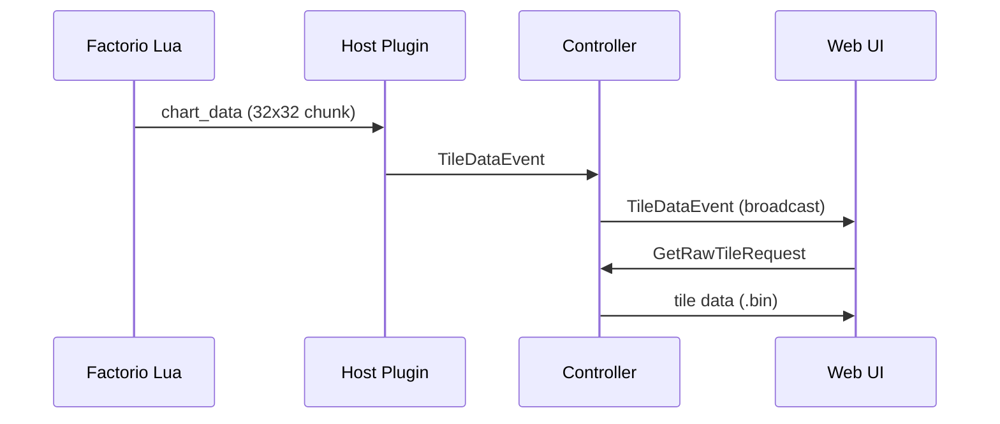

# Minimap Tile Data Storage Format

## Overview
The minimap plugin stores terrain visualization data in a compact binary format optimized for both live updates and historical timelapse playback. The system uses append-only tiles that capture pixel changes over time.

## Architecture

### Data Flow


### Storage Organization
- **Tile size**: 256×256 pixels (8×8 chunks of 32×32 each)
- **Filename**: `<instance>_<surface>_<force>_<tileX>_<tileY>.bin`
- **Location**: `database_directory/minimap_tiles/`
- **Format**: Append-only binary records

## Binary Format

### Color Encoding
Map colors use **RGB565** format (Factorio's internal representation):
- 5 bits red, 6 bits green, 5 bits blue
- 16 bits (2 bytes) per pixel

### Record Types
All timestamps use `⌊tick / 60⌋` (seconds) as uint32.

| Bytes | Field  | Description                 |
| ----- | ------ | --------------------------- |
| 1     | `type` | `1=Chunk`, `2=PixelChanges` |

#### Chunk Record (Type 1)
Initial exploration data for a 32×32 area.

| Bytes | Field             | Description                      |
| ----- | ----------------- | -------------------------------- |
| 4     | `tick` (uint32)   | ⌊tick / 60⌋ timestamp            |
| 1     | `coords` (uint8)  | `(chunkX << 4) \| chunkY`        |
| 2     | `length` (uint16) | Compressed data length           |
| n     | `data`            | Deflate-compressed RGB565 pixels |

- **Chunk coordinates**: 4-bit X and Y (0-7 within tile)
- **Data**: 32×32×2 bytes (2048 bytes uncompressed)
- **Compression**: Deflate (zlib)

#### Pixel Changes Record (Type 2)  
Incremental updates for pixels sharing the same color transition.

| Bytes | Field               | Description                 |
| ----- | ------------------- | --------------------------- |
| 4     | `tick` (uint32)     | ⌊tick / 60⌋ timestamp       |
| 2     | `count` (uint16)    | Number of pixels changed    |
| 2     | `new_color` (uint16)| New RGB565 value            |
| 2     | `old_color` (uint16)| Previous RGB565 value       |

**Per pixel coordinate (2 bytes each):**
| Bytes | Field       | Description                  |
| ----- | ----------- | ---------------------------- |
| 1     | `x` (uint8) | X coordinate in tile (0-255) |
| 1     | `y` (uint8) | Y coordinate in tile (0-255) |

**Note**: Multiple Type 2 records may be generated for a single tick if pixels have different color transitions. Each record groups pixels that share the same `old_color` -> `new_color` transition.

## Processing Strategy

### Live Updates
1. **Exploration**: New chunks sent as Type 1 records
2. **Changes**: Individual pixel updates grouped by color transition as Type 2 records  
3. **Optimization**: Pixels with identical color changes are batched together

### Storage Efficiency
- **Chunks**: ~100-500 bytes after compression (vs 2048 uncompressed)
- **Pixels**: 2 bytes per coordinate + 11-byte header per color group (vs 6 bytes per pixel in old format)
- **Timeline**: Old color values enable fast rewind without recalculation
- **Compression**: Grouping by color transitions provides significant space savings when many pixels change to the same colors

### Timelapse Playback
1. **Forward**: Apply chunks and pixel changes up to target tick
2. **Backward**: Revert pixel changes using old_color values
3. **Chunks**: Revert to black when rewinding past exploration time

## Implementation Notes

### Saving Process
```
1. Queue chunk data in chunkSavingQueue
2. Every 5 seconds, process queued chunks:
   - Load existing tile (if exists)
   - Compare new chunk pixels with current tile state  
   - Group pixel differences by color transition
   - Generate compressed pixel change records
   - Append new data to tile file (never modify existing)
```

### Web Client Rendering
```
1. Request tile data with optional maxTick parameter
2. Parse binary records sequentially 
3. Apply chunks and pixel changes up to target time
4. Convert RGB565 to RGBA for Canvas rendering
5. Overlay live broadcasts for real-time updates
```

### Cross-Platform Compatibility
- **Node.js**: Uses Buffer with native endian operations
- **Browser**: Uses Uint8Array with manual bit manipulation
- **Shared utilities**: `tile-utils.ts` handles platform differences
